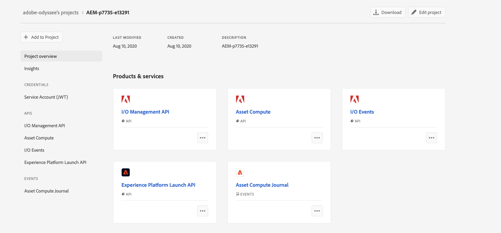
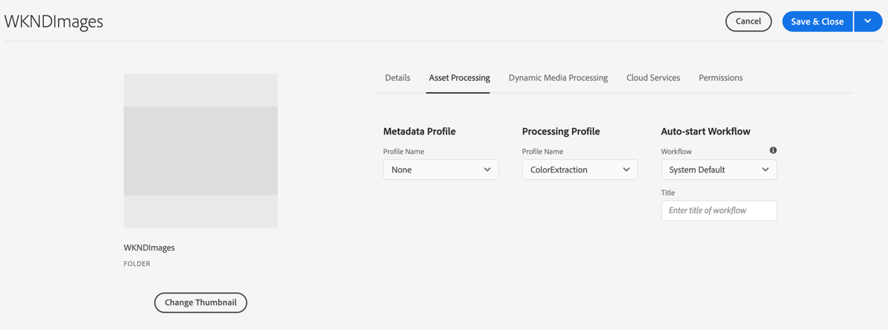

# DAM in AN AI First World Tech Lab Adapt To 2020 - Instruction 

## Adding Credentials - Custom Worker Contd

Since you logged in during app creation, most of the credentials are already collected in your `.env` file. You only need to add a few credentials needed for the [developer tool](https://git.corp.adobe.com/nui/nui/blob/master/doc/developer/CustomWorkerDeveloperGuide.md#developer-tool-credentials).

*If you did not log in, read this document to [set up credentials manually](https://git.corp.adobe.com/nui/nui/blob/master/doc/developer/SettingUpCredentialsManually.md).*

#### Developer Tool Credentials

**Pre-requisite**: Make sure to have access to a cloud storage container. Currently, we only support Azure Blob Storage and AWS S3.

*Note: This can be a shared container used by multiple developers across different projects.*

Add the following credentials to the `.env` file in the root of your Firefly project:

1. Add the absolute path to the private key file created while adding services to your Firefly Project:

   ```
   ASSET_COMPUTE_PRIVATE_KEY_FILE_PATH=
   ```

2. Add either S3 or Azure Storage credentials. (You only need access to one cloud storage solution(if you have ,else use the below credential)):

   ```
   # S3 credentials
   S3_BUCKET=
   AWS_ACCESS_KEY_ID=
   AWS_SECRET_ACCESS_KEY=
   AWS_REGION=
   
   # Azure Storage credentials
   AZURE_STORAGE_ACCOUNT=sanmishrblobs
   AZURE_STORAGE_KEY='D0IISFPFe4tp1IGbl9r8ZrZSCNBDbJVhHHa0icRU2Nm5AIa6TKMkaRJkxB7NupIAIuwHNvP6qKEVOGe9I4emoA=='
   AZURE_STORAGE_CONTAINER_NAME=adapttoblobs
   ```

### Local Development

#### Running the Application

##### **Pre-requisites**:

- Make sure to properly configure the [development tool credentials](https://git.corp.adobe.com/nui/nui/blob/master/doc/developer/CustomWorkerDeveloperGuide.md#developer-tool-credentials) in the `.env` file.
- Make sure to have [docker desktop](https://www.docker.com/products/docker-desktop) installed and running on your machine. You need docker running to run the worker tests

To run the application, use the following command:

```
aio app run
```

This will deploy the action to Adobe I/O Runtime and start the development tool on your local machine. This tool is used for testing worker requests during development. Here is an example rendition request:

```
"renditions": [
    {
        "worker": "https://1234_my_namespace.adobeioruntime.net/api/v1/web/example-custom-worker-master/worker",
        "name": "image.jpg"
    }
]
```

*Note: Do not use the `--local` flag with the run command. It does not work with Asset Compute custom workers and the Asset Compute Developer Tool. Custom workers are invoked by the Asset Compute Service which cannot access actions running on developer's local machines.*

#### Debug

#### Test

To test the worker, run the following command:

```
aio app test
```

#### Adding Worker Tests

To add additional worker tests, follow the guidlines [here](https://git.corp.adobe.com/nui/nui/blob/master/doc/developer/AddWorkerTests.md)

#### Deploy (This is not required for this lab)

To deploy the worker, run the following command (This is not required for this lab):

```
aio app deploy
```

# Content and Commerce AI overview

Content and Commerce AI is a set of AI services that allow you to extract intelligent features from your content, organize and streamline content flow, and deliver more impactful, personalized experiences to your customers.

All brands strive to deliver a perfect customer experience. You're constantly trying to find better answers all aspects of your customer touchpoints.

Content is an essential component of these experiences. To better answer marketing questions, you must understand content and your customers' interactions with it. With Content and Commerce AI, you can learn what features of the content you provide resonates with your customers. Using these insights allows you to personalize experiences and boost KPIs.

You can find more details about it [here](https://docs.adobe.com/content/help/en/experience-platform/intelligent-services/content-commerce-ai/overview.html) 

This is Still in Beta , below we will try 2 features from this API  

- Color Extraction 
- Keyword Extraction 

## Color Extraction 

The color extraction service, when given an image, can compute a histogram of pixel colors and sort them by dominant colors into buckets. The colors in the image pixels are bucketed into 40 predominant colors which are representative of the color spectrum. A histogram of color values is then computed among those 40 colors

### Getting Started 

1. Go To project inside  [Console.adobe.io](https://console.adobe.io/projects)

2. Make sure you have selected adobe-odyssee as your current organisation 

3. Depending on your assignment  open AEM-pxxx-exxx91 project  

4. Click Download on the top right corner / or use the ones provided directly in this repository.
   - [index.js](./index.js)
   - [manifest.yml](./manifest.yml)
   - [package.json](./package.json)

   

5. Replace the content of index.js and adapt the content of package.json accordingly ( Do not replace package.json as is ,only ad the missing dependecies )

6. Goto the parent directory of the project and execute npm install it will update the project with missing depedencies 

7. aio app use <path to Adobe I/O Developer Console configuration file from step 5 above> // *This will setup your .env to point at the Firefly project and workspace*

8. $     aio app deploy // *this will deploy the application* 

   

   Note the URL endpoint for your new Firefly App. We’ll use this when creating a processing profile in AEM


#### **Create a Processing Profile**

1. From     the AEM > Tools > Assets > Processing Profiles
2. Click     Create
3. Give     your Processing Profile a title, and then click on "Custom" tab
4. Enable     "Create Metadata Rendition" toggle
5. For     "Endpoint URL" input the URL of the worker as seen after     running aio app deploy for your Firefly application

​     

6. Click     on Save

 

 

#### **Update Metadata Schema to support output of your Custom Worker**

***\**** *Note: this schema should be configured/customized to meet your own use case. The instructions below are to support the simple color extraction custom worker included **

- From the AEM > Tools > Assets >     Metadata Schemas

- Select "default"

- Click on Edit

- Click on + to add a new Sensei     CCAI tab

- Click on "Build Form"

- Drag "Single Line Text" on the     form

- - Name: Color Extraction
  - Map to      property: ./jcr:content/metadata/ccai:colorExtraction

- Click on "Build Form" again,     Drag "Multi Value Text" on the form

- - Name: Color Extraction List
  - Map to      property: ./jcr:content/metadata/ccai:colorExtractionArray

 

- Click on Save

 

#### **Associate Processing Profile with Folder**

- From the AEM > Navigation > Assets 
- Create a folder for testing this worker,     if one does not exist
- Hover the folder and click the check mark
- Click "Properties" in the top     pane
- Click "Asset Processing" and     select the new Processing Profile that you created in the previous steps

 

- Click Save

 

**Test it!**

- Upload a PNG or JPG to the folder that     you set up in Step 2.

- Wait for the asset to stop processing

- Hover over the asset and click on the i

- - Or alternatively select the asset and      click on Properties

- Switch to the Sensei CCAI tab

 

- You should see the list of extracted     colors


## Keyword  Extraction (To be updated this week )

