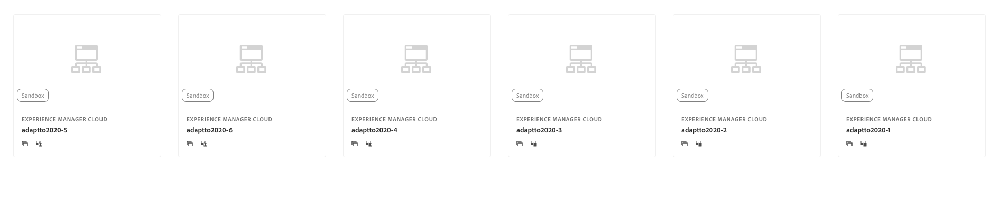
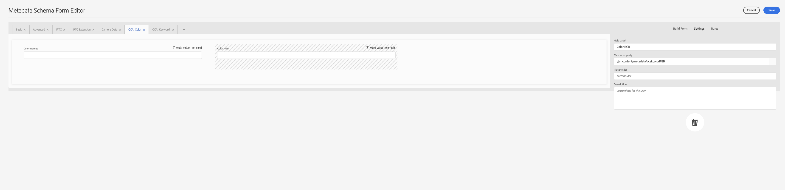
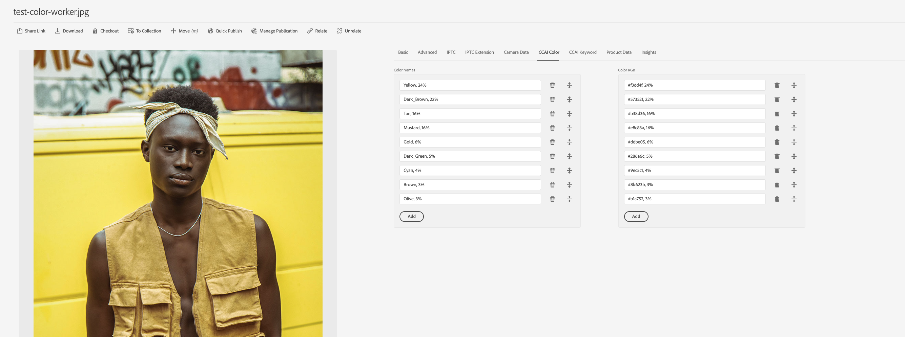
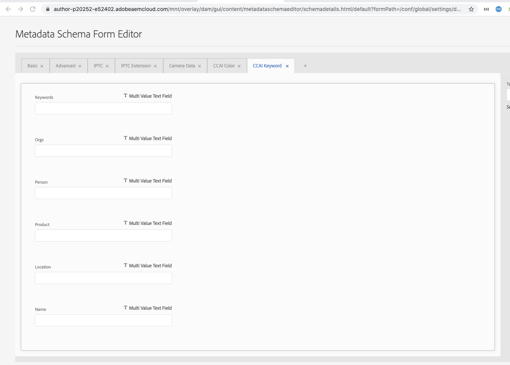
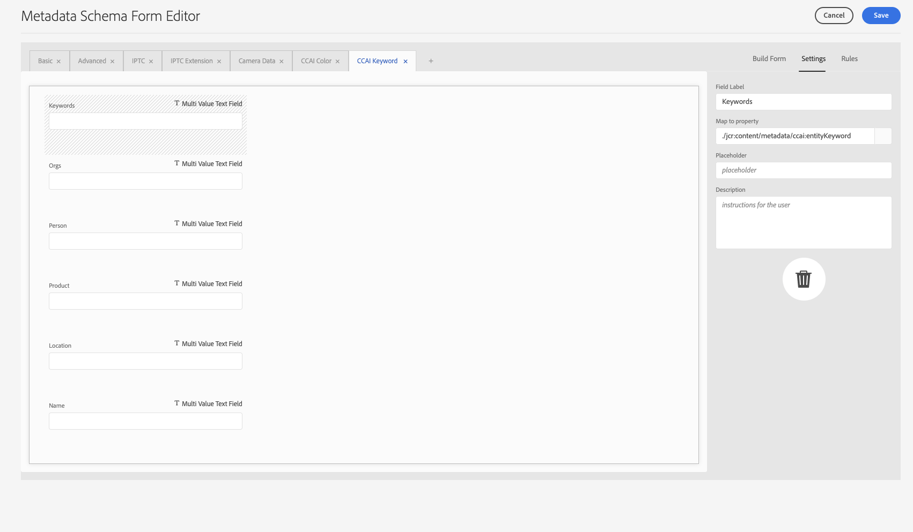
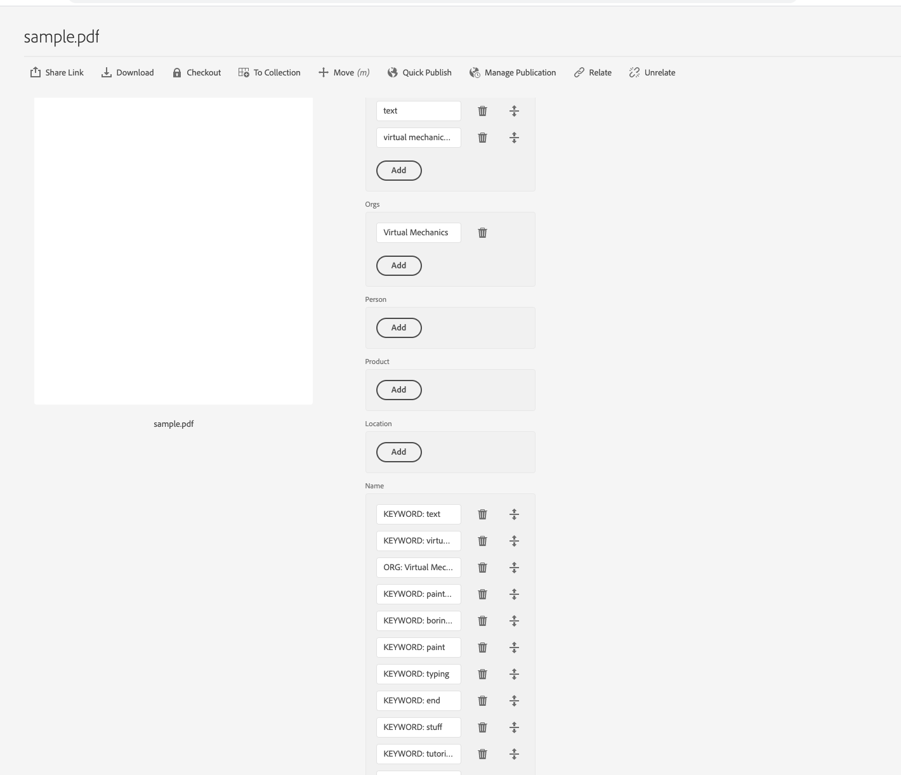
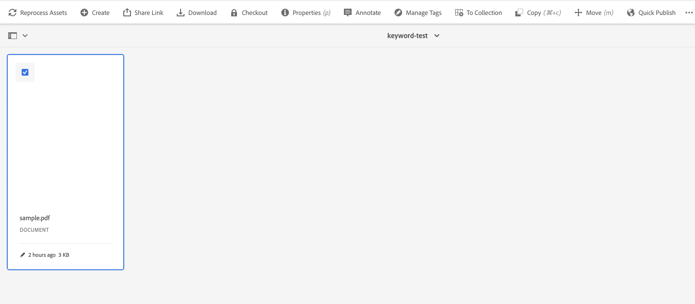

# DAM in AN AI First World Tech Lab Adapt To 2020 - Instruction

- [DAM in AN AI First World Tech Lab Adapt To 2020 - Instruction](#dam-in-an-ai-first-world-tech-lab-adapt-to-2020---instruction)
  - [Adding Credentials - Custom Worker Contd](#adding-credentials---custom-worker-contd)
    - [Developer Tool Credentials](#developer-tool-credentials)
    - [Local Development](#local-development)
      - [Pre-requisites](#pre-requisites)
      - [Running the example Application](#running-the-example-application)
      - [Debug](#debug)
      - [Test](#test)
      - [Adding Worker Tests](#adding-worker-tests)
      - [Deploy (This is not required for this lab)](#deploy-this-is-not-required-for-this-lab)
- [Content and Commerce AI overview](#content-and-commerce-ai-overview)
  - [Color Extraction](#color-extraction)
    - [Getting Started](#getting-started)
      - [Create a Processing Profile](#create-a-processing-profile)
      - [Update Metadata Schema to support output of your Custom Worker](#update-metadata-schema-to-support-output-of-your-custom-worker)
      - [Associate Processing Profile with Folder](#associate-processing-profile-with-folder)
  - [Keyword  Extraction (To be updated this week )](#keyword-extraction-to-be-updated-this-week-)

## Adding Credentials - Custom Worker Contd

Since you logged in during app creation, most of the credentials are already collected in your `.env` file. You only need to add a few credentials needed for the [developer tool](https://git.corp.adobe.com/nui/nui/blob/master/doc/developer/CustomWorkerDeveloperGuide.md#developer-tool-credentials).

*If you did not log in, read this document to [set up credentials manually](https://git.corp.adobe.com/nui/nui/blob/master/doc/developer/SettingUpCredentialsManually.md).*

### Developer Tool Credentials

**Pre-requisite** Make sure that you have access to a cloud storage container. Currently, we only support Azure Blob Storage and AWS S3.

*Note: This can be a shared container used by multiple developers across different projects.*

Add the following credentials to the `.env` file in the root of your Firefly project:

1. Add the absolute path to the private key file created while adding services to your Firefly Project:

   ```
   ASSET_COMPUTE_PRIVATE_KEY_FILE_PATH=
   ```

2. Add either S3 or Azure Storage credentials. (You only need access to one cloud storage solution(if you have ,else use the below credential)):

   ```
   # S3 credentials
   S3_BUCKET=
   AWS_ACCESS_KEY_ID=
   AWS_SECRET_ACCESS_KEY=
   AWS_REGION=
   
   # Azure Storage credentials
   AZURE_STORAGE_ACCOUNT=sanmishrblobs
   AZURE_STORAGE_KEY='D0IISFPFe4tp1IGbl9r8ZrZSCNBDbJVhHHa0icRU2Nm5AIa6TKMkaRJkxB7NupIAIuwHNvP6qKEVOGe9I4emoA=='
   AZURE_STORAGE_CONTAINER_NAME=adapttoblobs
   ```

### Local Development

#### Pre-requisites

- Make sure to properly configure the [development tool credentials](https://git.corp.adobe.com/nui/nui/blob/master/doc/developer/CustomWorkerDeveloperGuide.md#developer-tool-credentials) in the `.env` file.
- Make sure to have [docker desktop](https://www.docker.com/products/docker-desktop) installed and running on your machine. You need docker running to run the worker tests

#### Running the example Application

This example app / worker sends a local image to blob storage. Afterwards you can select it in the dropdown and click on run. This will start the Adobe I/O worker / action, calculate a dummy rendition and send it back to your machine.

To run the application, use the following command:

```
aio app run
```

This will deploy the action to Adobe I/O Runtime and start the development tool on your local machine. This tool is used for testing worker requests during development. Here is an example rendition request:

```
"renditions": [
    {
        "worker": "https://1234_my_namespace.adobeioruntime.net/api/v1/web/example-custom-worker-master/worker",
        "name": "image.jpg"
    }
]
```

*Note: Do not use the `--local` flag with the run command. It does not work with Asset Compute custom workers and the Asset Compute Developer Tool. Custom workers are invoked by the Asset Compute Service which cannot access actions running on developer's local machines.*

#### Debug

#### Test

To test the worker, run the following command:

```bash
aio app test
```

#### Adding Worker Tests

To add additional worker tests, follow the guidlines [here](https://git.corp.adobe.com/nui/nui/blob/master/doc/developer/AddWorkerTests.md).

#### Deploy (This is not required for this lab)

To deploy the worker, run the following command (This is not required for this lab):

```bash
aio app deploy
```

# Content and Commerce AI overview

Content and Commerce AI is a set of AI services that allow you to extract intelligent features from your content, organize and streamline content flow, and deliver more impactful, personalized experiences to your customers.

All brands strive to deliver a perfect customer experience. You're constantly trying to find better answers all aspects of your customer touchpoints.

Content is an essential component of these experiences. To better answer marketing questions, you must understand content and your customers' interactions with it. With Content and Commerce AI, you can learn what features of the content you provide resonates with your customers. Using these insights allows you to personalize experiences and boost KPIs.

You can find more details about it [here](https://docs.adobe.com/content/help/en/experience-platform/intelligent-services/content-commerce-ai/overview.html). 

This is Still in Beta, below we will try 2 features from this API  

- Color Extraction 
- Keyword Extraction 

## Color Extraction 

The color extraction service, when given an image, can compute a histogram of pixel colors and sort them by dominant colors into buckets. The colors in the image pixels are bucketed into 40 predominant colors which are representative of the color spectrum. A histogram of color values is then computed among those 40 colors.

Please take a look at the [Official Color Extraction Documentation](https://docs.adobe.com/content/help/en/experience-platform/intelligent-services/content-commerce-ai/api/color-extraction.html) to understand the used code fragments from the workers 'index.js'.

> ⚠ *analyzer_id* determines which Sensei Content Framework is used. Please check that you have the proper analyzer_id before making your request. For color extraction service, the analyzer_id ID is: *Feature:image-color-histogram:Service-6fe52999293e483b8e4ae9a95f1b81a7*

### Getting Started 

1. Go To project inside  [Console.adobe.io](https://console.adobe.io/projects)

2. Make sure you have selected adobe-odyssee as your current organisation 

3. Depending on your assignment  open AEM-pxxx-exxx91 project   (There are 6 lab env named adaptto2020-1 to  adaptto2020-6 you can be assigned to any one of them for this lab )  

   

4. Click Download on the top right corner / or use the ones provided directly in this repository.
   - [index.js](./index.js)
   - [manifest.yml](./manifest.yml)
   - [package.json](./package.json)

   

5. Replace the content of `\your-project\actions\worker\index.js` and adapt the content of `\your-project\package.json` accordingly 

   - Note, do not replace package.json as is, only add the missing dependecies .

6. Go to the parent / root directory of the project and execute npm install (`npm i`) it will update the project with its missing depedencies.

7. Update the following values in your local `.env` file. Doing this, will allow us to deploy to an already set up AEM instance.
   1. **Note**: you can alternativly execute `aio use <path/to/config.json> - which will be provided by the LAB leader.They are inside a folder named [**env_file**](https://github.com/houseofai/adaptto2020-aiworkshop/tree/master/DAM-Workshop/env_file) (For Sanity of this lab use only the env you are assigned with )
   2. AIO_ims_contexts_Project__1600253157454J_client__id=
   3. AIO_ims_contexts_Project__1600253157454J_client__secret=
   4. AIO_ims_contexts_Project__1600253157454J_technical__account__email=
   5. AIO_ims_contexts_Project__1600253157454J_technical__account__id=
   6. AIO_ims_contexts_Project__1600253157454J_meta__scopes=
   7. AIO_ims_contexts_Project__1600253157454J_ims__org__id=

8. `aio app deploy` // *this will deploy the application* 

9. If you make any changes, run `aio app undeploy` first.

   

   Note the URL endpoint for your new Firefly App. We’ll use this when creating a processing profile in AEM

#### Create a Processing Profile

1. From the AEM > Tools > Assets > Processing Profiles
2. Click Create
3. Give your Processing Profile a title, and then click on "Custom" tab
4. Enable "Create Metadata Rendition" toggle
5. For "Endpoint URL" input the URL of the worker as seen after running aio app deploy for your Firefly application

​     

6. Click on Save

#### Update Metadata Schema to support output of your Custom Worker

**Note**: this schema should be configured/customized to meet your own use case. The instructions below are to support the simple color extraction custom worker included.

- From the AEM > Tools > Assets > Metadata Schemas
- Select "default"
- Click on Edit
- Click on + to add a new Sensei CCAI tab
- Click on "Build Form"
- Drag "Multi Value Text" on the form
  - Name: Color Names
  - Map to      property: ./jcr:content/metadata/ccai:colorNames
- 
  
- Click on "Build Form" again, Drag "Multi Value Text" on the form
  - Name: Color RGB
  - Map to      property: ./jcr:content/metadata/ccai:colorRGB

   

- Click on Save 

#### Associate Processing Profile with Folder

- From the AEM > Navigation > Assets 
- Create a folder for testing this worker,     if one does not exist
- Hover the folder and click the check mark
- Click "Properties" in the top     pane
- Click "Asset Processing" and     select the new Processing Profile that you created in the previous steps

 

- Click Save 

**Test it!**

- Upload a PNG or JPG to the folder that     you set up in Step 2.
- Wait for the asset to stop processing
- Hover over the asset and click on the i
  - Or alternatively select the asset and      click on Properties
- Switch to the Sensei CCAI Color  tab

  

- You should see the list of extracted     colors

  

## Keyword  Extraction  

Example of a custom Asset Compute Metadata worker leveraging the [Content and Commerce AI](https://docs.adobe.com/content/help/en/experience-platform/intelligent-services/content-commerce-ai/overview.html) Keyword  extraction API from PDF .

The worker is based on [Project Firefly](https://github.com/AdobeDocs/project-firefly) and the [aio](https://github.com/adobe/aio-cli) developer tool.Copy the content of worker-ccai-keywordextract.js into yours index.js.

## Metadata

The worker returns the following metadata from the recognized list of named entities from the [keyword extraction API](https://docs.adobe.com/content/help/en/experience-platform/intelligent-services/content-commerce-ai/api/keyword-extraction.html). 

| Name                      | Metadata Type           | Description                                                  |
| ------------------------- | ----------------------- | ------------------------------------------------------------ |
| `ccai:entityKeyword`      | Multi Value Text        | List of keywords                                             |
| `ccai:entityOrganization` | Multi Value Text        | List of companies, agencies, institutions                    |
| `ccai:entityProduct`      | Multi Value Text        | List of objects, vehicles, foods, etc. (Not services)        |
| `ccai:entityPerson`       | Multi Value Text        | List of people, including fictional.                         |
| `ccai:entityLocation`     | Multi Value Text        | List of countries, cities, states, mountain ranges, and bodies of water. |
| `ccai:entityName`         | Multi Value Text        | List of entity names in order of highest score to lowest score |
| `ccai:entity`             | Sequence of XMP structs | List of entity features, with fields `ccai:name`, `ccai:type`, and `ccai:score`. Intended for advanced AEM customizations. |

The lists have the same order and are sorted from high to low score percentage.

## Deploy 

- Download the sources of this worker files from [here](https://github.com/houseofai/adaptto2020-aiworkshop/tree/master/text-worker-master) 

- Go to the `tex-worker-master` directory

- Run `npm install`

- Run 

  ```
  aio app use <Path to Adobe I/O Developer Console configuration file> (you can get it from env_file)
  ```

  - This will setup your `.env` to point at the Firefly project and workspace

- Run `aio app deploy` to deploy the application

### Review logs

- Use `aio app logs` to review the logs of the most recent invocation

## Integrating with AEM Cloud Service

### Create a Processing Profile

- From the AEM homepage, navigate to Tools -> Assets -> Processing profiles -> Create
- Select the Custom tab
- Enable *Create Metadata Rendition*
- For *Endpoint URL*, input the URL of the worker as seen after running `aio app deploy`
- Click on Save

### Associate Processing Profile with Folder

- Select the created Processing Profile
- Click on *Apply Profile to Folder(s)*
- Select a folder
- Click on *Apply*

### Update Metadata Schema

- From the AEM homepage, navigate to Tools -> Assets -> Metadata Schemas

- Select an existing schema like *default* and click on *Edit* or click *Create*

- Click on `+` to add a new *Content and Commerce AI* tab like ccai-keyword tab

- Create new metadata schema as mentioned inside MetaData table 

- For refernce you can follow this existing schema 

- 

- 

- Click on save once you are done .

  ### End to end test

  - Upload a pdf file 
  - Wait for the asset to stop processing
  - Click on the asset
  - Click on *Properties*
  - Switch to the CCAI-Keyword tab
  - 
  - In case you don't see the metadata reprocess it from here 
  - 

   

   

### 