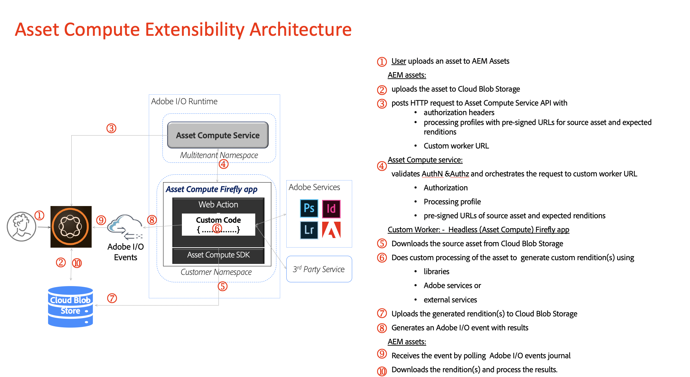

# DAM In an AI First World Workshop Adapt T0 2020 Prerequisite 

### Preparation

- Understand [Project Firefly](https://github.com/AdobeDocs/project-firefly)
- Access to an IMS organization with Skyline + Firefly (Participants will be given access 1 day Prior to the lab , but before start nothing stopping you from getting prepared )


### Overview

Asset Compute is a scalable, lightweight and extensible platform service for processing assets for AEM, running completely on Adobe I/O Runtime. It is easily extendable by creating custom workers based off [Project Firefly](https://www.adobe.io/apis/experienceplatform/project-firefly/docs.html#!AdobeDocs/project-firefly/master/overview/what_is.md). These custom workers are [Project Firefly Apps](https://www.adobe.io/apis/experienceplatform/project-firefly/docs.html#!AdobeDocs/project-firefly/master/getting_started/first_app.md) and can be written to do tasks such as add custom conversion tools, or call external APIs to perform image operations.

Linked here is [Project Firefly's documentation guide](https://www.adobe.io/apis/experienceplatform/project-firefly/docs.html).

Asset Compute Extensibility Architecture




### Pre-requisites

For testing your custom worker with the [developer tool](https://github.com/adobe/asset-compute-devtool), the following is also required:

- Access to a [cloud storage container](https://github.com/adobe/asset-compute-devtool#prerequisites). Currently, we support Azure Blob Storage and AWS S3.

  Notes:

  - Providing a cloud storage location is only needed for using the Asset Compute developer tool; a tool to help run tests in an environment that simulates an Asset Compute Client. You can still create, test, and deploy custom workers without developer tool.
  - This cloud storage is different than the AEM blob store.
  - This can be a shared container used by multiple developers across different projects.
  - ***This will be provided to you during the lab***

### Getting Started

#### Technical Requirements

Please install the following required tools:

- All [required tools](https://github.com/AdobeDocs/project-firefly/blob/master/getting_started/setup.md#required-tools) for a Firefly App
- [Docker Desktop](https://www.docker.com/get-started) (necessary for using the Asset Compute worker test framework)
- [Visual Studio Code](https://code.visualstudio.com/download) (VS Code) is recommended. You can use any other IDE as a code editor, but advanced usage (e.g. debugger) is not supported.

#### Set Up

1. Be granted System Admin or Developer Role access in the Experience Organization (We already took care of this for you ) [Admin Console](https://adminconsole.adobe.com/overview))

2. Log onto the [Adobe Developer Console](https://console.adobe.io/)

   - Make sure to be in the adobe-odyssey Adobe Experience Cloud Organization as the AEM as a Cloud Service Integration
   - *For reference, here is the [Adobe Developer Console](https://www.adobe.io/apis/experienceplatform/console/docs.html) documentation*

3. Create a new Project Firefly project (*Full instructions [here](https://www.adobe.io/apis/experienceplatform/project-firefly/docs.html#!AdobeDocs/project-firefly/master/getting_started/first_app.md)*)

   - Click `"Create new project" => "Project from template"` and choose `"Firefly"`
   - This will create a new Firefly Project with two workspaces: `Production` and `Stage`. Feel free to add additional workspaces (e.g. `Development`)

4. Inside the Firefly Project, choose a workspace and subscribe to the services needed for Asset Compute:

   - Click on `"Add to Project" => "API"` and add each of these services: `"Asset Compute"`, `"IO Events"`, `"IO Events Management", Content and Commerce AI(Select Product Profile when prompted)`

     

   *While adding the first API, you will be prompted to create a private key. Please save this somewhere safe on your machine. You will need this referenced in the .env file to use the developer tool.*

### Creating a Custom Worker using the Adobe CLI

Make sure to have the aio cli installed locally.

#### Initialize Firefly App with Asset Compute Template

1. To create a custom worker, start by [creating a new Firefly App](https://github.com/AdobeDocs/project-firefly/blob/master/getting_started/first_app.md#4-bootstrapping-new-app-using-the-cli). by running the following command in your terminalp:

   ```
   $ aio app init <app-name>  
   ```

    

   If you have not logged in already, this command will prompt a browser asking you to sign into the [Adobe Developer Console](https://console.adobe.io/) with your Adobe ID. See [here](https://github.com/AdobeDocs/project-firefly/blob/master/getting_started/first_app.md#3-signing-in-from-cli) for more information on signing in from the cli.

   *We recomend you login, but if you are having issues follow these instructions about [how to create an app without logging in](https://github.com/AdobeDocs/project-firefly/blob/master/getting_started/first_app.md#42-developer-is-not-logged-in-as-enterprise-organization-user).*

2. After logging in, follow the prompts in the CLI and select the `Organization`, `Project`, and `Workspace` to use for the application. Choose the project and workspace you created in the [set up](https://git.corp.adobe.com/nui/nui/blob/master/doc/developer/CustomWorkerDeveloperGuide.md#set-up).

   ```
   $ aio app init <app-name>  
   Retrieving information from Adobe I/O Console..
   ? Select Org My Adobe Org
   ? Select Project MyFireflyProject
   ? Select Workspace myworkspace
   create console.json
   ```

3. When prompted with `Which Adobe I/O App features do you want to enable for this project?`, make sure to select at least `Actions`:

   ```
   ? Which Adobe I/O App features do you want to enable for this project?
   select components to include (Press <space> to select, <a> to toggle all, <i> to invert selection)
   ❯◉ Actions: Deploy Runtime actions
   ◯ Events: Publish to Adobe I/O Events
   ◯ Web Assets: Deploy hosted static assets
   ◯ CI/CD: Include GitHub Actions based workflows for Build, Test and Deploy
   ```

4. When prompted `Which type of sample actions do you want to create?`, make sure to select `Adobe Asset Compute Worker`:

   ```
   ? Which type of sample actions do you want to create?
   Select type of actions to generate
   ❯◉ Adobe Asset Compute Worker
   ◯ Generic
   ```

5. Follow the rest of the prompts and open up the new application in VSCode (or your favorite code editor). This will contain the scaffolding and sample code for a custom worker.

   Read here about the [main components of a Firefly app](https://github.com/AdobeDocs/project-firefly/blob/master/getting_started/first_app.md#5-anatomy-of-a-project-firefly-application).

   The template worker leverages our [Asset Compute SDK](https://github.com/adobe/asset-compute-sdk#asset-compute-sdk) for the uploading, downloading, and orchestration of worker renditions so developers only need to implement the custom worker logic. Inside the `worker.js` file is where to add the custom worker code.

 


