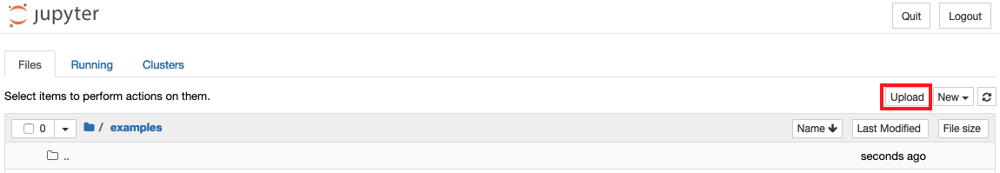

AdaptTo() 2020 - Workshop 2nd part - AEM and Jupyter Notebook
======


2.) Building Data Science Reports using AEM data and Jupyter Notebook
------

When starting the Jupyter server, Jupyter's works folder is the current folder. So, if you want to save your work, make sure to be in an accessible folder.
Still from your terminal, type in:
```
# Start the Jupyter server
> jupyter notebook
```
Then Jupyter server starts, and it automatically opens a page on the browser, listing the current folder.

### 2.2 Import the Jupyter Notebook

Download the Jupyter notebook from:
> https://raw.githubusercontent.com/houseofai/aempy/master/examples/AEMpy_Basics.ipynb

From Jupyter,


